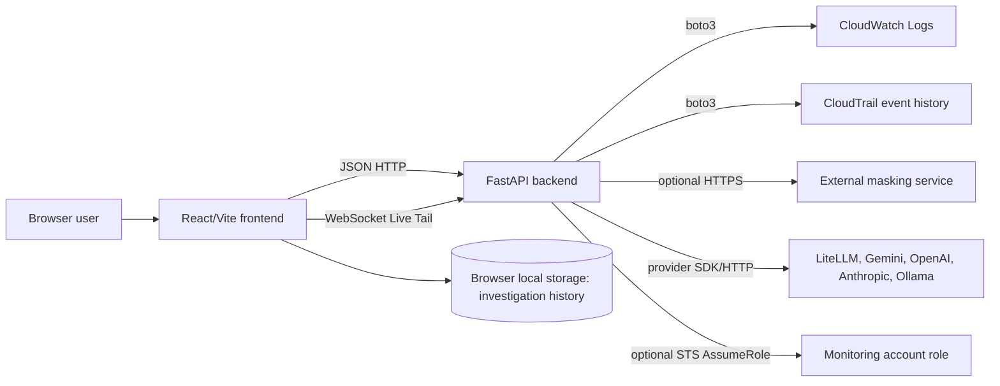
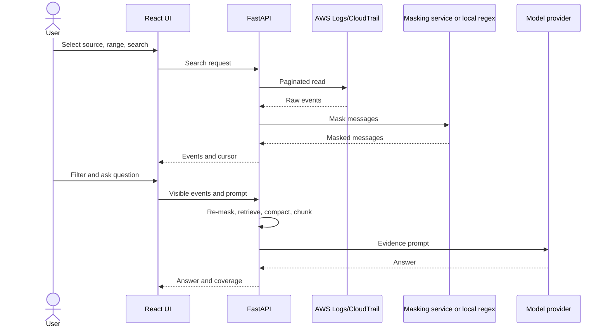

# Architecture

## Runtime components

`frontend/src/main.tsx` mounts `App.tsx`; `backend/app/main.py` constructs the FastAPI app and includes route modules. `docker-compose.yml` starts separate backend and frontend containers on ports 8000 and 5173 with development bind mounts. No application database, queue, cache service, or background worker deployment is present. The only backend worker thread found is created per Live Tail WebSocket to consume boto3's blocking stream.

## Boundaries and protocols

| Boundary | Data crossing it | Owner and controls |
| --- | --- | --- |
| Browser → backend | Search criteria, provider overrides, visible events, optional API key, WebSocket controls | FastAPI/Pydantic and service validation; HTTP rate limit; WebSocket Origin check. No built-in user auth. |
| Backend → AWS | Log-group discovery, filtered event search, CloudTrail lookup, Live Tail | boto3 credential chain and optional assumed role; IAM is external. |
| Backend → masker | Raw log sub-batches when configured | `masking.py` with HTTP timeout and local fallback; TLS verification setting defaults false. |
| Backend → model | Re-masked, selected/chunked evidence plus prompt/history | Provider adapters and app-level pacing/retries. |
| Browser → local storage | Completed investigation questions and responses | `LogSummary.tsx`; browser profile controls access and retention. |

## Search and analysis data flow

CloudWatch and centralized CloudTrail use merged oldest-first pagination; regional CloudTrail uses newest-first `LookupEvents`. The UI assigns unique line indices as pages append. See [log-search.md](log-search.md), [api.md](api.md), and [data-model.md](data-model.md).

## Deployment trust boundary

The development Compose file publishes both service ports. The production Compose file builds a static frontend, proxies `/api` through Nginx, publishes only a host loopback port, and keeps the backend inside the Compose network. `deploy.sh` builds and verifies that local stack. Same-host processes can use the loopback API; containers on the project network can call the backend service. There is no caller authentication or remote ingress in this checkout; see [deployment.md](deployment.md) and [ASM-003](assumptions.md#asm-003). Treat host processes and containers attached to the network as trusted.
