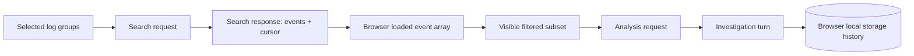

# Data model

## Storage model

**No application database is present.** There are no tables, migrations, primary keys, foreign keys, indexes, or repository classes in this checkout. AWS owns source log retention. The backend processes events in memory; search cursors serialize continuation state to the client. The browser holds current events in Zustand and stores completed investigation turns in `localStorage`. Database schema and backup/migration procedures are **Not currently applicable**.

## Domain and wire entities

| Entity | Fields and types | Constraints and lifecycle | Sensitive content |
| --- | --- | --- | --- |
| `LogEvent` | `source: cloudwatch|cloudtrail`, `origin:string`, `stream_or_key:string`, `timestamp: datetime|null`, `message:string`, `line_index:int` | Pydantic in `backend/app/schemas/common.py`; browser reassigns unique indices as rows append. | Message and metadata may include identity, infrastructure, or personal data. |
| `LogGroup` | `name`, `identifier`, `account_id?`, `stored_bytes?`, `creation_time?` | Discovery result from AWS; identifier may be group ARN for linked account. | Group name/account metadata. |
| Search request | Source-specific group/account/attribute filters, start/end datetimes, limit, cursor | Max time range and page cap enforced in services; see [api.md](api.md). | Query may identify assets/accounts. |
| Search response | `events[]`, `cursor?`, `truncated`, `total_returned` | Per-response; browser appends while cursor exists. | Masked messages and serialized cursor state. |
| Analysis request | `events[]`, `context.source_description`, provider/key/model/base URL, prompt, history | Counts and token budgets enforced in `AnomalyService`. | Optional provider key, user question/history, event content. |
| Analysis response | Answer, `references[]`, chunk/line/token counts, model, warnings | Returned per request; `references` is currently default empty, while UI parses line citations from answer text. | Generated answer may repeat sensitive context. |
| Saved investigation | `id`, `source`, `startTime`, `endTime`, `updatedAt`, `turns[]` of question/response | `LogSummary.tsx` stores at most 20 in `anomalog.investigation-history.v1`; user can delete. No server copy. | Questions and full answers. |
| Provider settings | Per-provider `apiKey`, `model`, `baseUrl` | Zustand in-memory state; selected values sent with requests; no local-storage persistence found. | API keys and chosen destination. |

`LogEvent` and request/response shapes are defined in `backend/app/schemas/` and mostly mirrored in `frontend/src/api/types.ts`. The frontend `AnalysisResponse` type currently omits the backend's `references` field; the UI parses citations from answer text instead. Browser selection state is in `frontend/src/state/selectionStore.ts`. The saved-investigation shape is local to `LogSummary.tsx`, not an HTTP entity.

## Relationships and lifetime

The cursor in `group_pagination.py` is compressed JSON carrying group names, AWS tokens, and pending masked events. It is query-bound by a hash but unsigned; do not treat it as a trusted database identifier. Browser history retention is bounded by item count, not by age or storage size. See [security.md](security.md).
