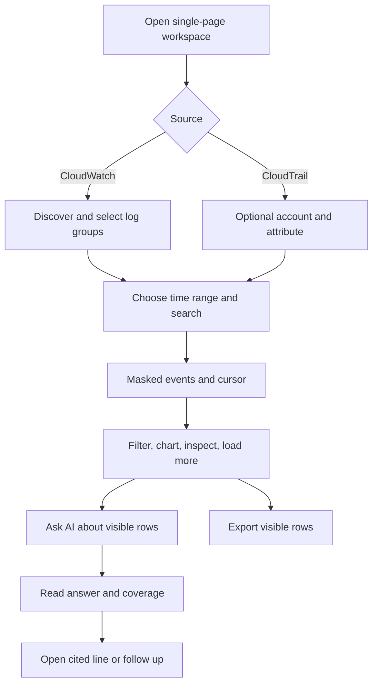

# User flows

## Historical investigation

Source switching clears the loaded result and invalidates old searches. A new search replaces events; `Load more` appends. The investigator receives the viewer's filtered events, not all rows held in browser state. Completed conversations may be saved in browser local storage; this is not a server account feature. Implementations: `frontend/src/App.tsx`, `useCloudWatchSearch.ts`, `useCloudTrailSearch.ts`, `LogViewer.tsx`, `LogSummary.tsx`.

## Live incident view

Choose CloudWatch groups → select **Start Live Tail** → review cost confirmation → confirm → WebSocket sends `start` → backend starts AWS stream → masked batches update dashboard/viewer. **Pause display** buffers browser events while AWS remains connected. **Resume** appends retained events. **Stop Live Tail**, page exit, source switch, inactivity, slow consumer, or AWS termination closes the session. See [live-tail.md](live-tail.md).

## Model selection

Open Model settings → choose LiteLLM/Gemini/OpenAI/Anthropic/Ollama → edit provider-specific values → optionally test connection → ask a question. The test result reports `success` and effective model; analysis submits currently selected provider settings. See [analysis.md](analysis.md).

## Authentication and administration

**Not currently applicable.** No registration, login, logout, password reset, app roles, administrative screen, or server-side user session exists in `frontend/src/` or `backend/app/`. AWS role assumption is backend infrastructure identity, not end-user login. Access to the deployed app must be controlled externally; see [authentication.md](authentication.md).
